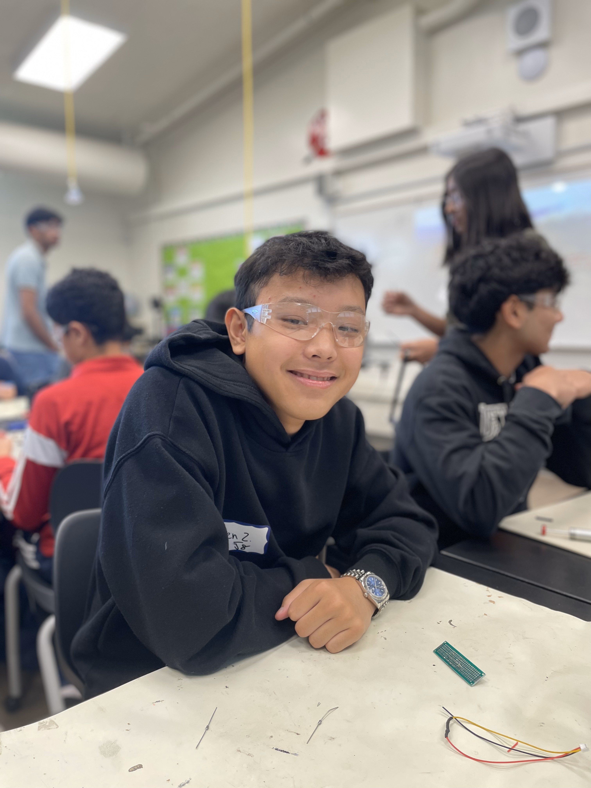
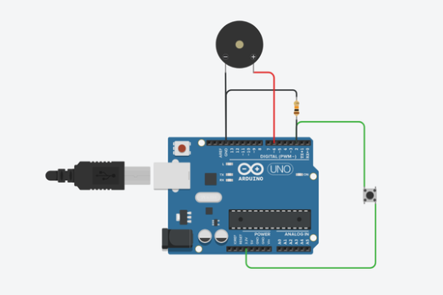

# Alarm Clock Mat
The alarm clock mat is my alternative to a regular alarm clock. To make early mornings a little more bearable, this alarm clock mat makes you get out of bed by only turning off after you step on the mat for around 10 seconds.  I chose this project due to the practical uses of helping me wake up and rewarding feelings that come from making something that you can use. 

<!---You should comment out all portions of your portfolio that you have not completed yet, as well as any instructions:
```HTML 
<!--- This is an HTML comment in Markdown -->
<!--- Anything between these symbols will not render on the published site 
```-->

| **Engineer** | **School** | **Area of Interest** | **Year** |
|:--:|:--:|:--:|:--:|
| Kenneth Z | Army and Navy Academy | Electrical Engineering | Incoming Sophmore

<!---**Replace the BlueStamp logo below with an image of yourself and your completed project. Follow the guide [here](https://tomcam.github.io/least-github-pages/adding-images-github-pages-site.html) if you need help.**-->


  
<!--# Final Milestone

**Don't forget to replace the text below with the embedding for your milestone video. Go to Youtube, click Share -> Embed, and copy and paste the code to replace what's below.**

<iframe width="560" height="315" src="https://www.youtube.com/embed/F7M7imOVGug" title="YouTube video player" frameborder="0" allow="accelerometer; autoplay; clipboard-write; encrypted-media; gyroscope; picture-in-picture; web-share" allowfullscreen></iframe>

For your final milestone, explain the outcome of your project. Key details to include are:
- What you've accomplished since your previous milestone
- What your biggest challenges and triumphs were at BSE
- A summary of key topics you learned about
- What you hope to learn in the future after everything you've learned at BSE

-->

# Second Milestone


<iframe width="560" height="315" src="https://www.youtube.com/embed/26AZEspi76I?si=fPQR-UcMzctfIyZs" title="YouTube video player" frameborder="0" allow="accelerometer; autoplay; clipboard-write; encrypted-media; gyroscope; picture-in-picture; web-share" referrerpolicy="strict-origin-when-cross-origin" allowfullscreen></iframe>

For my second milestone, I built the main framework of my project—a large push button made from layered cardboard, aluminum foil, and tape. When someone steps on it, the pressure causes the two foil layers inside to touch, completing a circuit and triggering the button.

One major challenge was making sure the foil layers didn’t touch when no pressure was applied. I solved this by adding more layers of cardboard and using popsicle sticks as spacers to act as a buffer. Another issue was debugging the original source code I used. The code had a variable called flag meant to track how long the button was being pressed, but it wasn’t working correctly. I fixed it by changing the logic to use while flag > 0, which allowed the button press to be properly detected and the timer to be looped.
Here's the code:
```c++
// Written by Arpan Mondal. Free to use and share!
int alarm_time = 0;

int flag = 0;

void setup()
{
    pinMode(6, OUTPUT);
    pinMode(2, INPUT);
    Serial.begin(115200);

    digitalWrite(6, HIGH);
    delay(1000); // Wait for 1000 millisecond(s)
    digitalWrite(6, LOW);
    alarm_time = 2; // 24 hours
}

void loop()
{
      delay(1000 * alarm_time); // Wait for 1000 * alarm_time millisecond(s)

    alarm_time = 2; // 24 hours
    flag = 10;
    while (flag >= 0) {
          Serial.println("we did a INNER WHILE loop");
        digitalWrite(6, HIGH);
        delay(500); // Wait for 500 millisecond(s)
        digitalWrite(6, LOW);
        delay(500); // Wait for 500 millisecond(s)
        alarm_time += -1;
        if (digitalRead(2) == HIGH) {
          Serial.println("we did a BUTTON PRESS");

            flag--;
        }
    }
    Serial.println("we did a loop");

}

```




Figure 2: This is the schematic for building milestone 2

# First Milestone

<iframe width="560" height="315" src="https://www.youtube.com/embed/BhGjILsohk8?si=OxTlA4F_4tes0roK" title="YouTube video player" frameborder="0" allow="accelerometer; autoplay; clipboard-write; encrypted-media; gyroscope; picture-in-picture; web-share" referrerpolicy="strict-origin-when-cross-origin" allowfullscreen></iframe>

For my first milestone, I successfully programmed a button to turn on an LED and display a message in the Arduino IDE’s serial monitor when pressed. This tested basic input and output, forming the foundation for my full project. The components used were a push button, LED, resistor, and an Arduino Uno. Next, I plan to add more elements like a buzzer and use state variables to manage multiple outputs and interactions. Some challenges were wiring the circuit properly, as I had never read a schematic before. 
Code:
```c++
const int buttonPin = 2;  // the number of the pushbutton pin
const int ledPin = 13;    // the number of the LED pin

// variables will change:
int buttonState = 0;  // variable for reading the pushbutton status

void setup() {
  // initialize the LED pin as an output:
  pinMode(ledPin, OUTPUT);
  // initialize the pushbutton pin as an input:
  pinMode(buttonPin, INPUT);
  Serial.begin(9600);
}

void loop() {
  // read the state of the pushbutton value:
  buttonState = digitalRead(buttonPin);

  // check if the pushbutton is pressed. If it is, the buttonState is HIGH:
  if (buttonState == HIGH) {
    // turn LED on:
    Serial.println("Button is pressed");
  } else {
    // turn LED off:
    Serial.println("Button is not pressed");
  }
}
```


Figure 1: the schematic for milestone 1

# Starter Project 
<iframe width="560" height="315" src="https://www.youtube.com/embed/i_Qjy-UGgfA?si=mueceY7raRXJ3AkQ" title="YouTube video player" frameborder="0" allow="accelerometer; autoplay; clipboard-write; encrypted-media; gyroscope; picture-in-picture; web-share" referrerpolicy="strict-origin-when-cross-origin" allowfullscreen></iframe>

The RGB slider that was my starter project included 3 key components fitted together with soldering: a circuit board, 3 sliders, and a LED light. Power came from a USB-C port on the side of the circuit board, and the 3 sliders adjusted the amount of red, blue, and green light shown in the LED light. By moving the sliders up and down, the user can adjust the color of the LED light, mixing the colors together to produce the intended light color. 


# Bill of Materials
Here's where you'll list the parts in your project. To add more rows, just copy and paste the example rows below.
Don't forget to place the link of where to buy each component inside the quotation marks in the corresponding row after href =. Follow the guide [here]([url](https://www.markdownguide.org/extended-syntax/)) to learn how to customize this to your project needs. 

| **Part** | **Note** | **Price** | **Link** |
|:--:|:--:|:--:|:--:|
| Uno R3 Arduino Starter Kit | Contains components such as wires, a arduino board, piezo buzzers and more | $40 | <"https://www.amazon.com/Arduino-A000066-ARDUINO-UNO-R3/dp/B008GRTSV6/"](https://www.amazon.com/ELEGOO-Project-Tutorial-Controller-Projects/dp/B01D8KOZF4/ref=sr_1_1?crid=1R6JAIOJQG24P&dib=eyJ2IjoiMSJ9._L3JiWgIo_Asrnpq9JBCAvVRunH8E1oHCQKGLOVkvyS85TuoLKJhznGzbQ9idV4KsaAKHvZcRz2KHsZUS7QI4ITHE2ulRB2-LhjQMirMd8ko1Cs3MrVSteobBXaeLRoDzcXTbUlLuEFEE32ohjzjqIpOzwGFan7tthcg7b587-SQLKspc9fevlCxIhNz7cRAtOAHNljnxmyxeB5NBr4QqjmYY3ZXGCnAYDgwyPV8baI.9U_ml9vIcuQAiFKd56JOjxnldf-Vu4gCT2FEOf8uw68&dib_tag=se&keywords=super+starter+kit+uno+r3+project&qid=1750719330&sprefix=super+starter+k%2Caps%2C185&sr=8-1)>  |
| Floor mat | The padding I actually step on to defuse the alarm | $15 | <"https://www.amazon.com/Arduino-A000066-ARDUINO-UNO-R3/dp/B008GRTSV6/"](https://www.amazon.com/OLANLY-Bathroom-Absorbent-Microfiber-Non-Slip/dp/B0BN7JL1QL/ref=sr_1_28?crid=12DXJLK1CKF03&dib=eyJ2IjoiMSJ9.OIMOyqyCShroAz8eAdGPGdPleUiY0izGY1uEUkKOetfsyhJ_uw75qSlLHChnIwzIiKMyAQcIm0RwUywRDa_Rj4gUCaFj4JmVVAuIJwOqw7AFwyQqx-tKronNX5-12OkjJkn9J7LyVbRC4irbb0oqL8c2nBzQGeYV1-tV02LPhWkytAMaxMReuYiE78U2FXMzerKFcKh4s3Jsvz_glZc-ydZByWjTu0Hpp7o92KBaOmSkQqXK5-ASfGbH-o3WUV6OsUOw88z4k1rvcrPN_S9fRzxxKVDliuNmmlhsYymZEQY.vCQjf7D4gvEhLHnsfjNF_B3zoH8eYwXicYwTCG2w_QE&dib_tag=se&keywords=blue%2Bbath%2Bmat&qid=1750719483&sprefix=blue%2Bbath%2Bma%2Caps%2C179&sr=8-28&th=1)>  |  
| Reynolds Aluminum foil| Conductor for the button | $14 | "https://www.amazon.com/Arduino-A000066-ARDUINO-UNO-R3/dp/B008GRTSV6/"> Link](https://www.amazon.com/Reynolds-Wrap-Aluminum-Foil-Square/dp/B0014D0T9E/ref=sr_1_6?crid=1S51KGPNE1TB&dib=eyJ2IjoiMSJ9.IUdu_HCIeaPP_eQJloO5gLLuutRAaL-vO327wANDpfZxuSig9ZwxVHZRUeqPf6L5Y5ZO0qMqvdLgf1nIT6Opa_41A4C9WV0wAh_Y1Zacq2E5eptOfP3HRtB8mhygThn-50yvw6GJa6XhNjVG3qOctrdm2jPEZtz4VJHpY_nkLA1leFY4OmTyj63tyZMOUNf9_gqWAHFci5GcotTRTKc00IB2UZKnT9si2SJ0cb8klLEPNBdjMsNavH-NCVfXMX6cFeF9jzfdFAKufpEbx90iBuTDauPtPwzzd_msyl1S_gw.FfwX-GyPRS5D8ZYGpvkBksT8D-EG0MpfBSpbl0rKFsQ&dib_tag=se&keywords=aluminum%2Bfoil&qid=1750719694&sprefix=alumi%2Caps%2C249&sr=8-6&th=1) |
| Cardboard | Building material | free |


