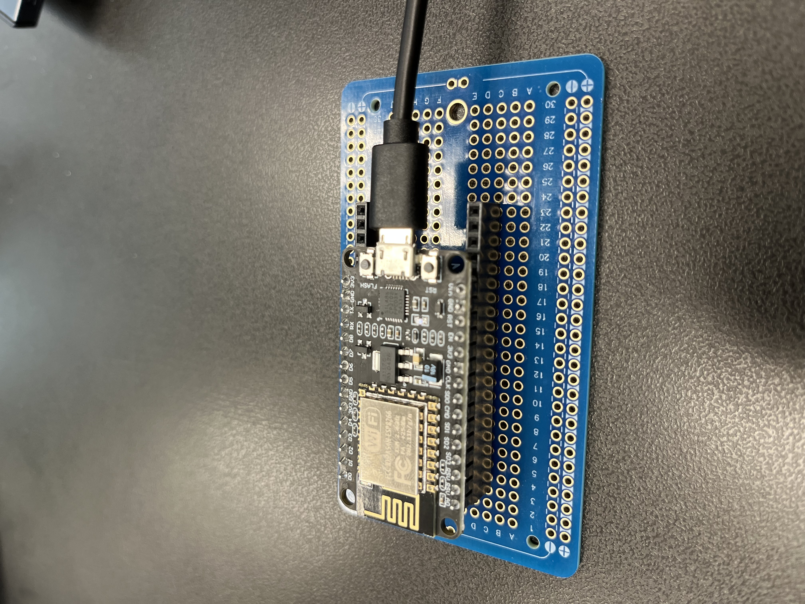

# Alarm Clock Mat
The alarm clock mat is my alternative to a regular alarm clock. To make early mornings a little more bearable, this alarm clock mat makes you get out of bed by only turning off after you step on the mat for around 10 seconds.  I chose this project due to the practical uses of helping me wake up and rewarding feelings that come from making something that you can use. 

<!---You should comment out all portions of your portfolio that you have not completed yet, as well as any instructions:
```HTML 
<!--- This is an HTML comment in Markdown -->
<!--- Anything between these symbols will not render on the published site 
```-->

| **Engineer** | **School** | **Area of Interest** | **Year** |
|:--:|:--:|:--:|:--:|
| Kenneth Z | Army and Navy Academy | Electrical Engineering | Incoming Sophmore


<!---**Replace the BlueStamp logo below with an image of yourself and your completed project. Follow the guide [here](https://tomcam.github.io/least-github-pages/adding-images-github-pages-site.html) if you need help.**-->
#  Final Milestone

<iframe width="560" height="315" src="https://www.youtube.com/embed/PHB6SvDTX4I?si=OO0PYsl0Nc39lFLJ" title="YouTube video player" frameborder="0" allow="accelerometer; autoplay; clipboard-write; encrypted-media; gyroscope; picture-in-picture; web-share" referrerpolicy="strict-origin-when-cross-origin" allowfullscreen></iframe>

For this milestone, I successfully integrated the Arduino IDE with Adafruit IO, allowing my ESP8266 to communicate with a web-based dashboard. This setup provided a simple and effective way to set alarms remotely using a text input feed. Once I had the IDE and libraries properly configured, I was able to send alarm times from the Adafruit dashboard to the ESP8266, which then compared them to the current time using an NTP (Network Time Protocol) client. This cloud-based control method made testing and triggering alarms much more intuitive and accessible.

The next step involved wiring a piezo buzzer and a button to the ESP8266 to create a physical response to the alarms. During testing, I realized that instead of using regular numeric pin references like `2` or `6`, I needed to use the ESP8266's labeled pin names like `D2` and `D6` to ensure compatibility. Debugging involved adjusting the buzzer logic and verifying correct GPIO behavior, which led to modifying the code to correctly control the buzzer and read button input. This phase of the project helped me better understand how to map digital pins on the ESP8266 and reinforced the importance of hardware-software alignment when integrating components.

```c++
#include "config.h"
#include <WiFiUdp.h>
#include <NTPClient.h>

WiFiUDP ntpUDP;
NTPClient timeClient(ntpUDP, "pool.ntp.org", -7 * 3600, 60000);  // Pacific Time (UTC-7)

String alarmTime = " ";  // user-specified alarm time

AdafruitIO_Feed *alarmTimeFeed = io.feed("time");
AdafruitIO_Feed *counter = io.feed("counter");

int count = 0;
int flag = 0;
bool alarmShouldTrigger = false;

// Buzzer and button pins
const int buzzerPin = D6;
const int buttonPin = D2;

void handleMessage(AdafruitIO_Data *data) {
  Serial.print("received <- ");
  Serial.println(data->value());
  alarmTime = String(data->value());
}

void setup() {
  Serial.begin(115200);
  delay(1000); // Give time for Serial to initialize

  pinMode(buzzerPin, OUTPUT);
  pinMode(buttonPin, INPUT);

  Serial.println("Connecting to Adafruit IO...");
  io.connect();

  // Subscribe to alarm time feed
  alarmTimeFeed->onMessage(handleMessage);

  // Wait for connection
  while(io.status() < AIO_CONNECTED) {
    Serial.print(".");
    delay(500);
  }

  Serial.println();
  Serial.println("Connected to Adafruit IO!");
  timeClient.begin();  // Start NTP time client
}

void loop() {
  io.run();            // Always run this first
  timeClient.update(); // Update time

  String currentTime = timeClient.getFormattedTime().substring(0, 5);
  Serial.print("Current Time: ");
  Serial.println(currentTime);

  // Send count to Adafruit IO
  Serial.print("Sending count -> ");
  Serial.println(count);
  counter->save(count);
  count++;

  // Trigger alarm logic
  if (currentTime.equals(alarmTime) && alarmTime.length() > 0 && !alarmShouldTrigger) {
    Serial.println("⏰ ALARM TRIGGERED!");
    alarmShouldTrigger = true;  // Prevent retriggering until done
    runAlarm();
  }

  delay(3000); // Adafruit IO rate limit buffer
}

void runAlarm() {
  flag = 10; // Reset flag counter (10 presses to stop)
  while (flag >= 0) {
    Serial.println("🔁 Buzzing...");
    digitalWrite(buzzerPin, HIGH);
    delay(500);
    digitalWrite(buzzerPin, LOW);
    delay(500);

    if (digitalRead(buttonPin) == HIGH) {
      Serial.println("🔕 Button pressed.");
      flag--;
    }
  }

  Serial.println("✅ Alarm stopped.");
  alarmShouldTrigger = false; // Reset alarm trigger
}
```


  
# Third Milestone

<iframe width="560" height="315" src="https://www.youtube.com/embed/m4v1c9e7zp0?si=aY94Shd8bWKJ8hXu" title="YouTube video player" frameborder="0" allow="accelerometer; autoplay; clipboard-write; encrypted-media; gyroscope; picture-in-picture; web-share" referrerpolicy="strict-origin-when-cross-origin" allowfullscreen></iframe>

For my third milestone, I successfully integrated an ESP8266 board with Adafruit IO using the Arduino IDE. My code now sends time-based updates to the Adafruit IO website, which plays a key role in my alarm clock mat by tracking when the alarm should trigger.

One of my biggest challenges was debugging the preexisting code, especially getting the ESP8266 to actually connect and communicate with Adafruit IO. A major triumph was getting the whole system to work and building the DIY part of the project — a cardboard button that interacts with my setup.

During BSE, I learned about soldering, Ohm’s Law, C++ programming, and circuitry. After this experience, I’m excited to keep learning and improving my skills in electronics and coding.

```c++
#include "config.h"

/************************ Example Starts Here *******************************/

// this int will hold the current count for our sketch
int count = 0;

// set up the 'counter' feed
AdafruitIO_Feed *counter = io.feed("counter");

void setup() {

  // start the serial connection
  Serial.begin(115200);

  // wait for serial monitor to open
  while(! Serial);

  Serial.print("Connecting to Adafruit IO");

  // connect to io.adafruit.com
  io.connect();

  // wait for a connection
  while(io.status() < AIO_CONNECTED) {
    Serial.print(".");
    delay(500);
  }

  // we are connected
  Serial.println();
  Serial.println(io.statusText());

}

void loop() {

  // io.run(); is required for all sketches.
  // it should always be present at the top of your loop
  // function. it keeps the client connected to
  // io.adafruit.com, and processes any incoming data.
  io.run();

  // save count to the 'counter' feed on Adafruit IO
  Serial.print("sending -> ");
  Serial.println(count);
  counter->save(count);

  // increment the count by 1
  count++;

  // Adafruit IO is rate limited for publishing, so a delay is required in
  // between feed->save events. In this example, we will wait three seconds
  // (1000 milliseconds == 1 second) during each loop.
  delay(3000);

}
```



Figure 3: this is the picture of the circuitry for milestone 3. Here, I simplified the design to just use a ESP8266 board, connected to my computer with a micro USB cord. After finalizing, I will connect the board up with the speaker and my button, using my code that I made to get the local time and add code to be able to get the buzzer to ring at set times. 

# Second Milestone


<iframe width="560" height="315" src="https://www.youtube.com/embed/26AZEspi76I?si=fPQR-UcMzctfIyZs" title="YouTube video player" frameborder="0" allow="accelerometer; autoplay; clipboard-write; encrypted-media; gyroscope; picture-in-picture; web-share" referrerpolicy="strict-origin-when-cross-origin" allowfullscreen></iframe>

For my second milestone, I built the main framework of my project—a large push button made from layered cardboard, aluminum foil, and tape. When someone steps on it, the pressure causes the two foil layers inside to touch, completing a circuit and triggering the button.

One major challenge was making sure the foil layers didn’t touch when no pressure was applied. I solved this by adding more layers of cardboard and using popsicle sticks as spacers to act as a buffer. Another issue was debugging the original source code I used. The code had a variable called flag meant to track how long the button was being pressed, but it wasn’t working correctly. I fixed it by changing the logic to use while flag > 0, which allowed the button press to be properly detected and the timer to be looped.
Here's the code:
```c++
// Written by Arpan Mondal. Free to use and share!
int alarm_time = 0;

int flag = 0;

void setup()
{
    pinMode(6, OUTPUT);
    pinMode(2, INPUT);
    Serial.begin(115200);

    digitalWrite(6, HIGH);
    delay(1000); // Wait for 1000 millisecond(s)
    digitalWrite(6, LOW);
    alarm_time = 2; // 24 hours
}

void loop()
{
      delay(1000 * alarm_time); // Wait for 1000 * alarm_time millisecond(s)

    alarm_time = 2; // 24 hours
    flag = 10;
    while (flag >= 0) {
          Serial.println("we did a INNER WHILE loop");
        digitalWrite(6, HIGH);
        delay(500); // Wait for 500 millisecond(s)
        digitalWrite(6, LOW);
        delay(500); // Wait for 500 millisecond(s)
        alarm_time += -1;
        if (digitalRead(2) == HIGH) {
          Serial.println("we did a BUTTON PRESS");

            flag--;
        }
    }
    Serial.println("we did a loop");

}

```


Figure 2: This is the schematic for building milestone 2. This is very similar to milestone 1, except that instead of the LED blinking when the button is pressed, that output is changed to a speaker turning off. The schematic is a good thing to build to get a sense of how the button interacts with the speaker, and then the next step should be building the cardboard button with tinfoil, essentially making a DIY button with wires hooked up to the tinfoil. 

# First Milestone

<iframe width="560" height="315" src="https://www.youtube.com/embed/BhGjILsohk8?si=OxTlA4F_4tes0roK" title="YouTube video player" frameborder="0" allow="accelerometer; autoplay; clipboard-write; encrypted-media; gyroscope; picture-in-picture; web-share" referrerpolicy="strict-origin-when-cross-origin" allowfullscreen></iframe>

For my first milestone, I successfully programmed a button to turn on an LED and display a message in the Arduino IDE’s serial monitor when pressed. This tested basic input and output, forming the foundation for my full project. The components used were a push button, LED, resistor, and an Arduino Uno. Next, I plan to add more elements like a buzzer and use state variables to manage multiple outputs and interactions. Some challenges were wiring the circuit properly, as I had never read a schematic before. 
Code:
```c++
const int buttonPin = 2;  // the number of the pushbutton pin
const int ledPin = 13;    // the number of the LED pin

// variables will change:
int buttonState = 0;  // variable for reading the pushbutton status

void setup() {
  // initialize the LED pin as an output:
  pinMode(ledPin, OUTPUT);
  // initialize the pushbutton pin as an input:
  pinMode(buttonPin, INPUT);
  Serial.begin(9600);
}

void loop() {
  // read the state of the pushbutton value:
  buttonState = digitalRead(buttonPin);

  // check if the pushbutton is pressed. If it is, the buttonState is HIGH:
  if (buttonState == HIGH) {
    // turn LED on:
    Serial.println("Button is pressed");
  } else {
    // turn LED off:
    Serial.println("Button is not pressed");
  }
}
```


Figure 1: This is my schematic for building the first milestone. In this project, the button is hooked up to hole 2 on the arduino board, which is then set as the input with our code. The button state is constantly being checked, and whenever the button is pressed, the new state will show up in the serial monitor. Also, the LED on the arduino next to hole 13 will blink when the button is pressed. 

# Starter Project 
<iframe width="560" height="315" src="https://www.youtube.com/embed/i_Qjy-UGgfA?si=mueceY7raRXJ3AkQ" title="YouTube video player" frameborder="0" allow="accelerometer; autoplay; clipboard-write; encrypted-media; gyroscope; picture-in-picture; web-share" referrerpolicy="strict-origin-when-cross-origin" allowfullscreen></iframe>

The RGB slider that was my starter project included 3 key components fitted together with soldering: a circuit board, 3 sliders, and a LED light. Power came from a USB-C port on the side of the circuit board, and the 3 sliders adjusted the amount of red, blue, and green light shown in the LED light. By moving the sliders up and down, the user can adjust the color of the LED light, mixing the colors together to produce the intended light color. 


# Bill of Materials

| **Part** | **Note** | **Price** | **Link** |
|:--:|:--:|:--:|:--:|
| Uno R3 Arduino Starter Kit | Contains components such as wires, a arduino board, piezo buzzers and more | $40 | <https://a.co/d/0FFsECl>  |
| Floor mat | The padding I actually step on to defuse the alarm | $15 | <https://a.co/d/iSu9joU>  |  
| Reynolds Aluminum foil| Conductor for the button | $14 | <https://a.co/d/9MRLwEK> |
| Cardboard | Building material | free |


